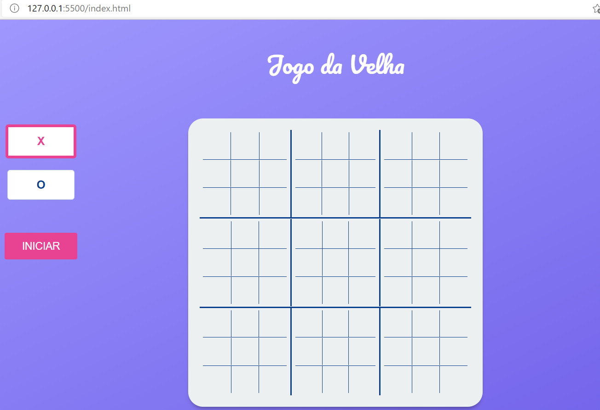
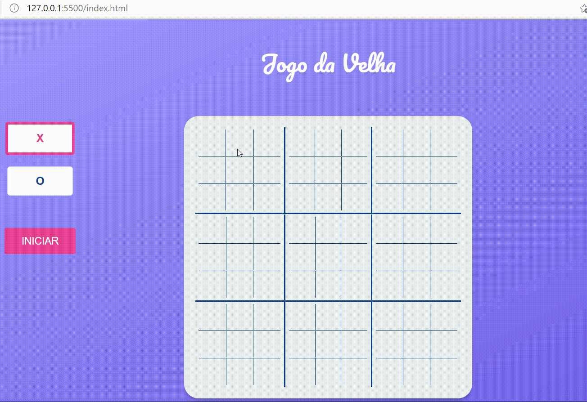

# Jogo da Velha Turbinado


Trabalho em grupo desenvolvido como requisito para obtenção de nota parcial para a disciplina de Tópicos 1. Este trabalho tem como requisito que seja desenvolvido com HTML, CSS e Javascript puros ou utilizando o framework Bootstrap 4.
É necessário que sejam utilizadas as funções JQuery **click** e **delay**.

## Imagens do Jogo






## Utilização das Funções do JQuery

### Click

A função **click** foi utilizada para disparar o comportamento esperado em cada div após o evento do DOM "click". Ela é uma forma mais direta de implementação do código abaixo em javascript vanila.

```javascript
const foo = document.getElementById("foo");
foo.addEventListener("click", () => {
   //comportamento esperado
});
```
Neste exemplo após clicar com o mouse no elemento de id *foo*, será disparada a função anônima com o comportamento esperado.

### Delay

A função **delay** foi utilizada para adicionar uma melhor usabilidade no jogo. Através dela pode-se adicionar um contador e disparar uma ação somente quando esse timer terminar. Ela é uma forma mais direta de implementação do código abaixo em javascript vanila.

```javascript
setTimeout(() => { 
   //comportamento esperado após o timer 
}, 1500);
```
Nesse exemplo, o código dentro da função anônima só será executado quendo o tempo de 1,5 segundos (1500 milissegundos) tiver passado.

## Descrição das Funções

### Função de Inicialização do Script

Através do monitoramento do evento *load* do DOM é possivel contruir uma função que chame as funções do arquivo para inicializar os comportamentos esperados do elementos do HTML. Uma vez que o DOM entre no estado *load* a função anônima é disparada.

```javascript
window.addEventListener("load", () => { 
   //comportamento esperado após o load da página
   //função getDivJogo
   //prepara o botão de reiniciar
});
```

### Função getDivsJogo

Esta função montará, através de laços *for* encadeados e de forma automatizada, os id's das divs existentes no HTML. Uma vez formado o id da div correspondente à iteração do laço, esta é utilizada para adicionar o event listener de *click* à div. Este evento irá disparar as funções que farão o controle dos jogadores, a verificação dos vencedores e concequente encerramento do jogo.

```javascript
const getDivJogo = () => {
   //laços for encadeados para formar a variável letra
   $(`#${letra}`).click(() => {
      //coloca X ou O dentro da div, dependendo do jogador que clicou
      //função verificar para encontrar o vencedor
      //muda de jogador
      //retira o evento de click da div
   })
};
```

### Função verificar

Esta função é a mais importante do código, pois utiliza a posição dentro do tabuleiro da div clicada para alimentar um bloco switch case e encontrar o vencedor da rodada. Ela faz uma verificação na coluna da div clicada, outra na linha e, caso aplicável, na diagonal do tabuleiro.


## Contribuidores

| ***Avatar*** / ***Name*** / ***Dev Function*** |
|-------------|
| [](https://github.com/AmandaGValerio) &nbsp; [Amanda Valério](https://github.com/AmandaGValerio) &nbsp; *Funcionalidades JS* |
| [](https://github.com/laura-ratis) &nbsp; [Laura Ratis](https://github.com/laura-ratis) &nbsp; *Design e Layout* |
| [](https://github.com/ERAjeje) &nbsp; [Edson Ajeje](https://github.com/ERAjeje) &nbsp; *Funcionalidades JS* |

## License
[MIT](https://choosealicense.com/licenses/mit/)
